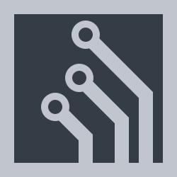

<div align="center">
  
  <h1>Altverse</h1>
  <p>A simple game/engine, a parody of evades.io</p>
</div>

# About

This version is an implementation of rust-napi for performance.

`A game similar to the popular evades.io.`

**Currently in deep development and finalization**

# Used

**napi-rs, ajv, uwebsocket.js**

```
At the moment, the development has been stopped due to its inexpediency.
```
